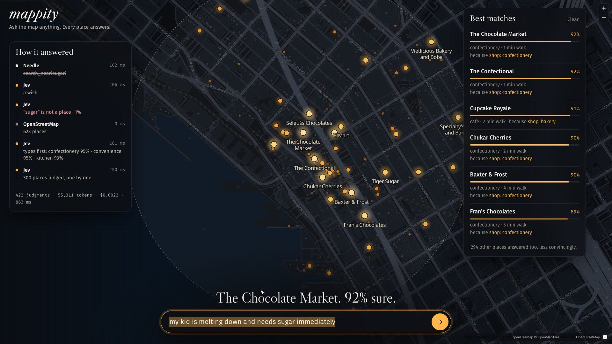

# mappity

Ask the map anything. Every place answers with a probability, and the map glows where the answer is yes.

[](https://kortexa-ai.github.io/mappity/)

**[Try the recorded demo](https://kortexa-ai.github.io/mappity/)** · **[Watch the two-minute film](demos/mappity-demo.mp4)** (narrated by Mira and Archibald, who loses a guessing game to a map)

Type *"my kid is melting down and needs sugar immediately"* and about a second later the chocolate
shops around you light up. No categories, no filters, no search index, and no chat model anywhere.

## Run it

```sh
npm install
cp .env.example .env    # add your two keys
./run.sh                # http://localhost:4321
```

You need Node 22 or newer, a [TypeSafe key](https://console.typesafe.ai/settings/keys) and a
[Mapillary token](https://www.mapillary.com/dashboard/developers). OpenStreetMap needs no key. Every
setting, including the addresses of the local servers, lives in `.env`; [`.env.example`](.env.example)
documents them all.

The command bar also talks to [needle.server](https://github.com/kortexa-ai/needle.server) at
`NEEDLE_URL`. Without it the app still answers wishes; it only loses "near the aquarium" and "take me
to Ballard".

## Who does what

| | Does | Cannot |
|---|---|---|
| **[Cactus Needle](https://github.com/kortexa-ai/needle.server/blob/main/llms.txt)** (local, ~50 ms) | Pulls open-valued arguments out of a sentence: `search_near("aquarium", 5)` | Judge anything. It turned "needs sugar" into `go_to("sugar")` at confidence 1.00 |
| **[TypeSafe Jev](https://docs.typesafe.ai)** (cloud, ~200 ms) | Answers typed questions with calibrated probabilities, hundreds at a time | Write text, count, do arithmetic, compare dates |
| **Code** | Geocoding, walking distance, fetching, combining scores | Understand what "cozy" means |

One question travels like this (`server/pipeline.js`):

1. **Needle** extracts commands and hard constraints.
2. **Jev**, one request: what kind of request is this, does the street matter, and is each thing Needle
   extracted really a place? ("sugar": 1%. "aquarium": 92%.)
3. **Code** geocodes the landmark with Nominatim and turns walking minutes into a radius.
4. **Code** fetches the places from OpenStreetMap (Overpass), and, when the street matters, what
   Mapillary's cameras saw within 50 m of each place: street lights, benches, crossings, cameras.
5. **Jev** judges place *types* first, in one request, so that only plausible places get their own question.
6. **Jev** judges up to 300 places in parallel batches. When the street matters each place gets two
   narrow questions, the place and its street, and code multiplies them.
7. **Jev** picks, for the best matches, the one known fact that explains the match. It cannot write a
   reason, but it can select one.

A typical answer is 250 to 700 judgments, about one second, and a fifth to half of a cent.

The **guessing game** (`server/game.js`) uses the same engine backwards. The map picks a secret place,
you ask yes/no questions, and Jev answers each question for all sixty candidates at once. The secret's
answer is what you hear; everyone's answers are Bayesian likelihoods, and the map dims accordingly.

## Things we measured, so you do not have to

- **Do not index long arrays.** Asking about `` `places[i]` `` was 100% right with 15 places in the state,
  95% with 30, and 75% with 60, because Jev has to count to the index. Keyed objects
  (`` `places.place_17` ``) stayed above 99% at every size.
- **Put short values in the question itself.** Judging `` `place_types[37]` `` ranked gift shops over ATMs
  for "I need cash". Writing `"atm"` into the question gave ATM 0.98, bank 0.97.
- **Split vague judgments.** "A good place to walk to alone at 11pm?" scored every place about 0.8.
  Two narrow questions (the place; its street) gave a spread from 0.10 to 0.86 that follows the evidence.
- **Never give Needle a free-text argument.** It copies spans from the input. Let it extract names and
  numbers, and let Jev verify them; Needle's own confidence does not catch its mistakes.
- **Mapillary's `/images?bbox=` answers HTTP 500 in dense areas.** The map-feature vector tiles work, and
  one z14 tile of downtown Seattle holds about 200,000 detections.
- **Mapillary counts measure camera traffic.** The same lamp is detected on every drive-by, so the street
  context is ranked against the other candidates ("lots", "some", "few", "none seen"), never sent as numbers.

## The demo video

The film is in [`demos/`](demos/mappity-demo.mp4). To make it again:

```sh
npm run demo:narrate     # a TTS server speaks each line, an ASR server checks every take (TTS_URL, ASR_URL)
npm run demo:record      # drives the real app in headless Chromium and captures 1080p frames
MUSIC=~/music/some-instrumental.mp3 npm run demo:assemble -- demos/mappity-demo.mp4
```

Nothing on screen is staged. The guessing game's outcome is whatever happens, and the narration has a
line for either ending. The first take in a new area is a rehearsal: it warms the OpenStreetMap cache.

## The site

[kortexa-ai.github.io/mappity](https://kortexa-ai.github.io/mappity/) is the landing page plus the real
client playing back recorded answers, so it needs no server and no keys. `scripts/build-site.sh` builds
it into `_site/`, and the Pages workflow deploys it on every push to `main`.
`node --env-file=.env demo/capture-replays.mjs` records fresh answers from a running server.

## Being a good guest

Overpass, Nominatim and OpenFreeMap are free community services. Places are cached on disk in fixed
grid tiles for a day, geocodes for a month, Mapillary tiles for a week, and Overpass queries run one at
a time. The cache lives in `.cache/`.

## Layout

```
server/index.js      HTTP server, static files, NDJSON streaming
server/pipeline.js   the question pipeline described above
server/game.js       the guessing game
server/jev.js        TypeSafe client      server/needle.js     needle.server client
server/osm.js        Overpass, Nominatim  server/mapillary.js  street detections
public/              the web client: MapLibre GL, no build step
site/                the GitHub Pages landing page and the recorded answers it plays back
demos/               the demo film
demo/                how the film is made: narration, recorder, and assembly
experiments/         the measurements behind "Things we measured"; run with node --env-file=.env
scripts/ask.sh       ask the running server a question from the terminal and print each pipeline step
tests/               unit tests for the geometry (npm test)
```

## Credits and license

Places © [OpenStreetMap contributors](https://www.openstreetmap.org/copyright) (ODbL). Street detections
© [Mapillary](https://www.mapillary.com) (CC BY-SA). Basemap by [OpenFreeMap](https://openfreemap.org).
Judgments by [TypeSafe Jev](https://typesafe.ai). Extraction by [Cactus Needle](https://cactuscompute.com/needle).

[MIT](LICENSE) © kortexa.ai
